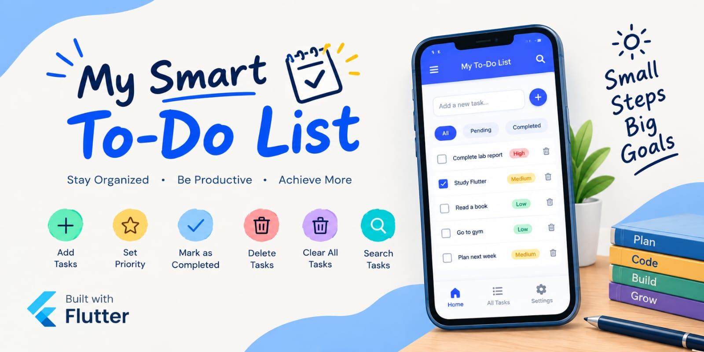

# My Smart To-Do List

## Project Progress

### Commit 1 – Initial Project
Created the basic Flutter To-Do List application.

### Commit 2 – Improve App Title/UI
Updated the application title and improved the UI.

### Commit 3 – Clear All Tasks
Added a button to clear all tasks.

### Commit 4 – Empty Task Validation
Added validation for empty task names.

### Commit 5 – Task Search
Added a search feature to find tasks easily.

## Features

- Add tasks
- Set priority
- Mark tasks as completed
- Delete tasks
- Clear all tasks
- Search tasks